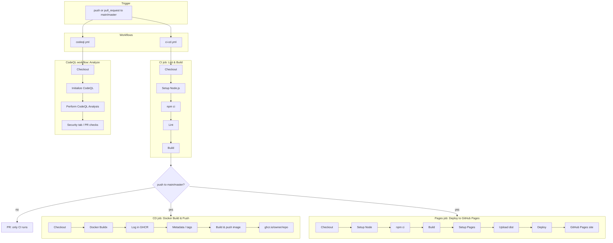
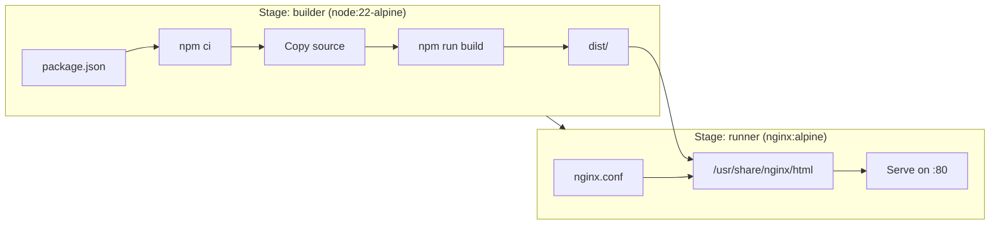

# CI/CD Architecture

This document describes the end-to-end CI/CD setup: workflows, jobs, Docker, and Nginx.

---

## Overview

| Workflow | File | Triggers | Purpose |
|----------|------|----------|---------|
| **CI/CD** | `.github/workflows/ci-cd.yml` | `push` / `pull_request` to `main` or `master` | Lint, build, Docker image push, GitHub Pages deploy |
| **CodeQL** | `.github/workflows/codeql.yml` | `push` / `pull_request` to `main` or `master` | Security and code quality analysis |

### Architecture diagram (Mermaid)

GitHub renders Mermaid in this file. Below: full pipeline, then Docker build stages.

**Pipeline (workflows + jobs):**



**Docker image build (multi-stage):**



**Pipeline flow (CI/CD workflow):**

```
                    push or pull_request
                              │
                              ▼
┌─────────────────────────────────────────────────────────────────────────┐
│  CI job (Lint & Build)                                                   │
│  1. Checkout repo                                                        │
│  2. Setup Node.js                                                        │
│  3. Install dependencies (npm ci)                                        │
│  4. Lint (npm run lint)                                                  │
│  5. Build (npm run build)                                                │
└─────────────────────────────────────────────────────────────────────────┘
                              │
              ┌───────────────┴───────────────┐
              │ only on push to main/master   │
              ▼                               ▼
┌──────────────────────────────┐  ┌──────────────────────────────────────────┐
│  CD job (Docker Build & Push) │  │  Pages job (Deploy to GitHub Pages)     │
│  1. Checkout                  │  │  1. Checkout                            │
│  2. Set up Docker Buildx      │  │  2. Setup Node.js                       │
│  3. Log in to GHCR            │  │  3. Install dependencies                 │
│  4. Extract metadata (tags)   │  │  4. Build (with base path for Pages)     │
│  5. Build and push image      │  │  5. Setup Pages                          │
│     → ghcr.io/owner/repo       │  │  6. Upload artifact (dist)               │
└──────────────────────────────┘  │  7. Deploy to GitHub Pages               │
                                  └──────────────────────────────────────────┘
```

**CodeQL workflow** runs in parallel with CI (separate workflow):

```
push or pull_request
        │
        ▼
┌─────────────────────────────────────────────────────────────────────────┐
│  Analyze job (CodeQL)                                                    │
│  1. Checkout repository                                                 │
│  2. Initialize CodeQL (javascript-typescript)                            │
│  3. Perform CodeQL Analysis                                              │
│     → results in Security tab / PR checks                                │
└─────────────────────────────────────────────────────────────────────────┘
```

---

## CI/CD Workflow (`.github/workflows/ci-cd.yml`)

### Triggers

- **Push** to `main` or `master`
- **Pull request** targeting `main` or `master`

### Job 1: `ci` — Lint & Build

Runs on every push and every PR. Must pass before CD or Pages run.

| Step | Action | Purpose |
|------|--------|---------|
| **Checkout** | `actions/checkout@v5` | Clone the repository into the runner. |
| **Setup Node.js** | `actions/setup-node@v5` | Install Node.js 22 and enable `npm` cache. |
| **Install dependencies** | `npm ci` | Install exact versions from `package-lock.json` (reproducible). |
| **Lint** | `npm run lint` | Run ESLint; fails the job on errors. |
| **Build** | `npm run build` | Run Vite build; produces `dist/`. |

### Job 2: `cd` — Docker Build & Push

Runs only on **push** to `main` or `master` (not on PRs). Depends on `ci` passing.

| Step | Action | Purpose |
|------|--------|---------|
| **Checkout** | `actions/checkout@v5` | Fresh clone for the Docker build context. |
| **Set up Docker Buildx** | `docker/setup-buildx-action@v3` | Enable Buildx for multi-stage and caching. |
| **Log in to Container Registry** | `docker/login-action@v3` | Authenticate to GitHub Container Registry (`ghcr.io`) with `GITHUB_TOKEN`. |
| **Extract metadata for Docker** | `docker/metadata-action@v5` | Generate image tags and labels (branch, SHA, `latest` on main). |
| **Build and push Docker image** | `docker/build-push-action@v6` | Build the Dockerfile and push to `ghcr.io/<owner>/<repo>`. Uses GHA cache. |

**Output:** Image available as e.g. `ghcr.io/<owner>/<repo>:latest`, `:main`, `:<sha>`.

### Job 3: `pages` — Deploy to GitHub Pages

Runs only on **push** to `main` or `master`. Depends on `ci` passing. Uses the `github-pages` environment.

| Step | Action | Purpose |
|------|--------|---------|
| **Checkout** | `actions/checkout@v5` | Clone the repo. |
| **Setup Node.js** | `actions/setup-node@v5` | Node 22 + npm cache. |
| **Install dependencies** | `npm ci` | Same as CI. |
| **Build** | `npm run build` | Build with `GITHUB_REPOSITORY_NAME` set so Vite `base` matches the repo (e.g. `/portofolio/`). |
| **Setup Pages** | `actions/configure-pages@v4` | Prepare the runner for Pages deployment. |
| **Upload artifact** | `actions/upload-pages-artifact@v3` | Upload the `dist/` folder as the Pages artifact. |
| **Deploy to GitHub Pages** | `actions/deploy-pages@v4` | Deploy the artifact to GitHub Pages (site URL from the environment). |

**Output:** The static site is served at e.g. `https://<owner>.github.io/<repo>/`.

---

## CodeQL Workflow (`.github/workflows/codeql.yml`)

Runs on every push and every PR, independent of the CI/CD workflow. Used for security and quality checks.

| Step | Action | Purpose |
|------|--------|---------|
| **Checkout repository** | `actions/checkout@v5` | Clone the repo so CodeQL can analyze the code. |
| **Initialize CodeQL** | `github/codeql-action/init@v4` | Set up CodeQL and the database for `javascript-typescript`. |
| **Perform CodeQL Analysis** | `github/codeql-action/analyze@v4` | Run queries, upload results to the Security tab and PR checks. |

**Output:** Code Scanning results in the repo’s **Security** tab and as status checks on the PR.

---

## Docker Build

### Multi-stage Dockerfile

| Stage | Base image | Purpose |
|-------|------------|---------|
| **builder** | `node:22-alpine` | Install deps and run `npm run build` to produce `dist/`. |
| **runner** | `nginx:alpine` | Serve the built static files with Nginx. |

**Flow:**

1. **Build stage:** Copy `package*.json` → `npm ci` → copy source → `npm run build` → `dist/` is created.
2. **Production stage:** Copy `nginx.conf` and `dist/` from builder → Nginx serves them on port 80.

### Nginx Configuration (`nginx.conf`)

- **Listen:** Port 80.
- **Root:** `/usr/share/nginx/html` (where `dist/` is copied in the image).
- **SPA routing:** `try_files $uri $uri/ /index.html` so client-side routes work on refresh and direct links.
- **Static assets:** JS, CSS, images, fonts get long-lived cache (`expires 1y`, `Cache-Control: public, immutable`).

### Why Nginx Alpine (and not Apache httpd)?

We use **`nginx:alpine`** in the final Docker stage to serve the static SPA. Here’s how it compares to **Apache httpd** for this use case, and why Nginx Alpine is the better fit.

| Aspect | nginx:alpine | httpd (Apache) |
|--------|----------------|----------------|
| **Image size** | ~40 MB (Alpine base, minimal Nginx) | ~145 MB (Debian-based) or ~55 MB (Alpine-based `httpd:alpine`) — still larger than nginx:alpine. |
| **Static file performance** | Event-driven, very efficient for many small static files and concurrent connections. | Process/thread per request; fine for static but typically uses more memory under concurrency. |
| **Config for SPA** | One directive: `try_files $uri $uri/ /index.html`. | Needs `FallbackResource` or `RewriteRule`; slightly more verbose. |
| **Memory footprint** | Low; single process, worker model. | Higher; MPM (e.g. worker/prefork) uses more RAM per connection. |
| **Ecosystem** | Default choice in most “static site in Docker” examples and docs; easy to find snippets. | Common for dynamic apps (PHP, etc.); less often used as the only static server in a container. |
| **Alpine variant** | Official `nginx:alpine` is mature and widely used. | `httpd:alpine` exists but is less common than nginx:alpine. |

**Conclusion:** For a **static SPA in a container** (no server-side rendering, no PHP/Perl), **nginx:alpine is the better choice**: smaller image, lower memory use, simple SPA config, and a standard in the Docker/static-serving world. Apache httpd is a good fit when you need its features (e.g. `.htaccess`, mod_rewrite-heavy setups, or integration with other Apache modules); for “serve `dist/` with SPA fallback,” Nginx Alpine is simpler and more efficient.

### Build Context (`.dockerignore`)

Excluded from the Docker build context to keep the image small and avoid invalidating cache with irrelevant files:

- `node_modules`, `dist`, `.git`, `.github`, `*.md`, `.gitignore`, `.env*`, `.DS_Store`, `*.log`, `.vscode`, `.idea`.

---

## End-to-End Flow

1. **Developer pushes or opens a PR** to `main`/`master`.
2. **Local pre-commit hook (Husky)** runs on every `git commit`: `npm run lint`. This prevents committing code that fails ESLint before it even reaches CI.  
3. **CI job** runs: checkout → setup Node → `npm ci` → lint → build.  
   **CodeQL** runs in parallel: checkout → init CodeQL → analyze.
4. On **push to main/master** only:
   - **CD job** builds the Docker image from the Dockerfile (builder → runner with Nginx) and pushes it to `ghcr.io/<owner>/<repo>`.
   - **Pages job** builds the app with the correct `base`, uploads `dist/` as the Pages artifact, and deploys to GitHub Pages.
5. **Results:**
   - **GitHub Pages:** Static site at `https://<owner>.github.io/<repo>/`.
   - **Container:** Image `ghcr.io/<owner>/<repo>:latest` (and branch/SHA tags) for use in Cloud Run, Kubernetes, or `docker run`.

---

## Component Summary

| Component | Role |
|-----------|------|
| **Checkout** | Provides the repository source for every job. |
| **Setup Node.js** | Ensures Node 22 and npm cache for install/build. |
| **npm ci / lint / build** | Reproducible install, quality check, and production bundle. Locally, Husky runs `npm run lint` on every commit via the `pre-commit` hook. |
| **Docker Buildx** | Builds the multi-stage image with caching. |
| **GHCR login + metadata** | Authenticates and defines image tags/labels. |
| **Build and push** | Produces and publishes the container image. |
| **Configure Pages + upload artifact + deploy** | Publishes the static build to GitHub Pages. |
| **Initialize CodeQL** | Prepares the CodeQL database for the chosen language. |
| **Perform CodeQL Analysis** | Runs security/quality queries and reports results. |
| **Nginx** | Serves the static `dist/` and handles SPA routing and caching. |
